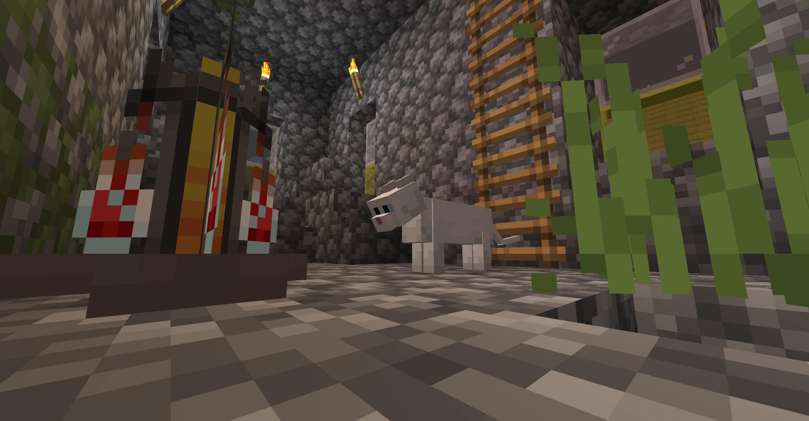

# OpenMorph

An open-source, universal camouflage plugin.

Want access to an early access version of OpenMorph? Support me from Patreon.

## Features

- No NMS
- No DataPacks
- Lightweight design
- Disguised as a block/entity/player

## Potential incompatibility

- Entity optimization plugin - To reduce external dependencies, OpenMorph uses a "real entity" design instead of a "
  virtual entity" design, which may cause some plugins to "falsely kill" OpenMorph entities.
- Plugin for customizing player names or titles - OpenMorph's detection and handling mechanism is currently very simple.
  However, due to the peculiar implementation of some plugins, OpenMorph may fail to hide player name tags, which is an
  issue.

## Other possible problems

- The generated OpenMorph entity keeps flashing.

This is likely because you set the current world's difficulty to "Peaceful." Normally, OpenMorph should detect if the
current world is running at an incorrect difficulty. If OpenMorph believes the current world is at "Peaceful"
difficulty, it should reject the disguise and remove the player's disguise.

However, due to a strange data anomaly, in rare cases, this detection won't work; you can simply have the player remove
the disguise.

- OpenMorph entity abnormal death

As I mentioned earlier, OpenMorph may be incompatible with some entity optimization plugins.

Because OpenMorph uses real entities, these plugins will include OpenMorph entities in their counters.

OpenMorph links generated entities to the player, enabling features such as simulating real damage, entity movement, and
entity death.

If these plugins clear OpenMorph entities while cleaning up other entities, the entity will be considered "dead" by the
system. At this point, OpenMorph doesn't know the cause of the entity's death; it only knows the bound entity is dead.
Therefore, OpenMorph will trigger a simulated entity death, and the player will also die.

- Why are the community edition updates so slowly? Is it possible to get the latest updates without paying?

Due to financial constraints, I have had to divide OpenMorph into Community Edition and Premium Edition. The Premium
Edition enjoys builds from the latest codebase, while the Community Edition's codebase is 45 days older than the Premium
Edition's.

Fixes for particularly serious bugs are not subject to the Premium codebase synchronization limitations.

- Why can't I see my disguise?

OpenMorph currently only supports previewing "blocks." If a player disguises themselves as an entity, only other players
can see this OpenMorph entity.

Enabling entity preview for a player will cause all of the player's attacks to land on the OpenMorph entity, and the
system will interpret this as the player attempting to attack themselves. This will prevent the player from damaging
other entities normally.

Unlike OpenMorph, FeatherMorph has a client-side renderer that can render the player as the target entity. However,
FeatherMorph is no longer being updated and will no longer be compatible with future versions of Minecraft. OpenMorph
does not have this feature, but it may be added in the future.

- Will OpenMorph be compatible with i18n?

There isn't one at the moment, this is a TODO item.

- When I'm disguised as another player, I can't see my own skin.

OpenMorph's current implementation of player morphing is quite bizarre.

You might encounter these issues: only you can't see your own skin; your messages display incorrect signatures, but
other players can see them; etc.

I will optimize these issues in the future.

## LICENSE

OpenMorph is licensed and distributed under the AGPL 3.0 License

Copyright © 2025 404Setup. All rights reserved.

Redistribution in any form is prohibited (including but not limited to: recreating a page about this plugin anywhere;
redistributing a binary version of this plugin; redistributing the Premium version; including this plugin in server
module packages distributed to others; etc.).