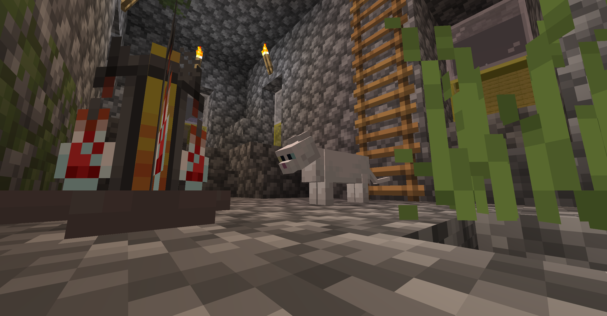

# OpenMorph

An open-source, universal camouflage plugin.

## Features

- No NMS
- No DataPacks
- Lightweight design
- Disguised as a block/entity/player

## Limitations

- Limited compatibility with other plugins
- Client-side renderer is not supported yet
- No Mod version yet
- Currently no time to create a GUI

## Usage

### Commands

OpenMorph utilizes Brigadier for its command structure. The primary command is `/om`.

#### General Commands

| Command                              | Description                                                      | Permissions & Notes                                                                                                                                                                                                          |
|--------------------------------------|------------------------------------------------------------------|------------------------------------------------------------------------------------------------------------------------------------------------------------------------------------------------------------------------------|
| `/om morph <type> <target> [player]` | Disguise yourself or another player.                             | Non-ops can only target themselves and must have unlocked the morph. Operators can target other players. `<type>` can be `entity`, `block`, or `player`. `<target>` is the entity type, block material, or player skin name. |
| `/om unmorph [player]`               | Remove active disguise.                                          | Operators can target other players.                                                                                                                                                                                          |
| `/om run <id> [player]`              | Execute an active morph skill.                                   | Currently supports Ghast skill `1` (Launches a large fireball, 2s cooldown).                                                                                                                                                 |
| `/om read`                           | Unlock the morph for the block currently held in your main hand. | Consumes 1 block of the item.                                                                                                                                                                                                |
| `/om drop <player> <type> <id>`      | Remove an unlocked morph from the player's collection.           | Non-ops can only drop their own morphs.                                                                                                                                                                                      |
| `/om request send <player>`          | Send a skin request to another player.                           | Request skin for player morph.                                                                                                                                                                                               |
| `/om request yes <player>`           | Accept a player's skin request.                                  |                                                                                                                                                                                                                              |
| `/om request no <player>`            | Deny a player's skin request.                                    |                                                                                                                                                                                                                              |
| `/om nametag`                        | Toggle name tag visibility.                                      | (Currently not fully implemented)                                                                                                                                                                                            |

#### Admin Commands

*Require `404morph.admin` permission or Operator status.*

| Command                           | Description                                  | Notes                                                                                                                |
|-----------------------------------|----------------------------------------------|----------------------------------------------------------------------------------------------------------------------|
| `/om append <player> <type> <id>` | Force grant/unlock a morph to a player.      | For blocks, use `hand` as `<id>` to use the block in your main hand. Use `all` to grant all entities/online players. |
| `/om info [player]`               | View morph status and unlocked morph stats.  | Non-ops can run `/om info` to check their own stats.                                                                 |
| `/om get`                         | Raytrace block or entity you are looking at. | Identifies if it is a morphed player or a real object/entity (range: 10 blocks).                                     |
| `/om saveall`                     | Force save all player morph data.            |                                                                                                                      |
| `/om lock <type> <id>`            | Globally disable/lock a specific morph.      | For blocks, `<id>` is optional and defaults to the block held in your main hand.                                     |
| `/om unlock <type> <id>`          | Globally re-enable/unlock a locked morph.    | For blocks, `<id>` is optional and defaults to the block held in your main hand.                                     |

#### Block Solidification & Permissions

When disguised as a block, players will attempt to solidify into a real block after remaining motionless for 120 ticks (
6 seconds). Solidifying triggers a `BlockPlaceEvent`.

- `om.morph.block.bypass_ground_check` - Allows solidifying without standing on the ground.
- `om.morph.block.bypass_restricted` - Allows solidifying as restricted blocks (e.g. Bedrock, Command Blocks, TNT,
  Hopper, Spawners, etc.).

### Container-based GUI

TODO

### SeeUI-based GUI

TODO

### Dialog-based GUI

TODO

## Configuration & Storage

Everything OpenMorph needs is stored directly inside its plugin directory (`plugins/OpenMorph/`). Here is the breakdown:

### Restricting Morphs (`locked_morphs.txt`)
If you want to blacklist certain blocks, entities, or player skins (like `bedrock`, `warden`, or a specific player skin), they are saved in `locked_morphs.txt`.
Each line uses the `type:id` format (for example, `block:bedrock`). You don't have to edit this file by hand—you can just use `/om lock <type> <id>` or `/om unlock <type> <id>` in-game and the plugin will update it automatically.

### Built-in Mob Hostility Mappings
By default, if you morph into a passive mob (like a Villager), hostiles like Zombies will still seek you out and attack you. This logic is handled by built-in hostility lists inside the plugin JAR (under `/data/hostility/`).
For instance, `villager.txt` lists all the aggressors (`ZOMBIE`, `PILLAGER`, `VINDICATOR`, etc.) that will target a player morphed as a villager, while `enderman.txt` lists the `ENDER_DRAGON`.

## Potential incompatibility

- Entity optimization plugin - To reduce external dependencies, OpenMorph uses a "real entity" design instead of a "
  virtual entity" design, which may cause some plugins to "falsely kill" OpenMorph entities.
- Plugin for customizing player names or titles - OpenMorph's detection and handling mechanism is currently very simple.
  However, due to the peculiar implementation of some plugins, OpenMorph may fail to hide player name tags, which is an
  issue.

## Other possible problems

- The generated OpenMorph entity keeps flashing.

This is likely because you set the current world's difficulty to "Peaceful." Normally, OpenMorph should detect if the
current world is running at an incorrect difficulty. If OpenMorph believes the current world is at "Peaceful"
difficulty, it should reject the disguise and remove the player's disguise.

However, due to a strange data anomaly, in rare cases, this detection won't work; you can simply have the player remove
the disguise.

- OpenMorph entity abnormal death

As I mentioned earlier, OpenMorph may be incompatible with some entity optimization plugins.

Because OpenMorph uses real entities, these plugins will include OpenMorph entities in their counters.

OpenMorph links generated entities to the player, enabling features such as simulating real damage, entity movement, and
entity death.

If these plugins clear OpenMorph entities while cleaning up other entities, the entity will be considered "dead" by the
system. At this point, OpenMorph doesn't know the cause of the entity's death; it only knows the bound entity is dead.
Therefore, OpenMorph will trigger a simulated entity death, and the player will also die.

- Why can't I see my disguise?

OpenMorph currently only supports previewing "blocks." If a player disguises themselves as an entity, only other players
can see this OpenMorph entity.

Enabling entity preview for a player will cause all of the player's attacks to land on the OpenMorph entity, and the
system will interpret this as the player attempting to attack themselves. This will prevent the player from damaging
other entities normally.

Unlike OpenMorph, FeatherMorph has a client-side renderer that can render the player as the target entity. OpenMorph
does not have this feature, but it may be added in the future.

- Will OpenMorph be compatible with i18n?

There isn't one at the moment, this is a TODO item.

- When I'm disguised as another player, I can't see my own skin.

OpenMorph's current implementation of player morphing is quite bizarre.

You might encounter these issues: only you can't see your own skin; your messages display incorrect signatures, but
other players can see them; etc.

I will optimize these issues in the future.

## LICENSE

OpenMorph is licensed and distributed under the AGPL 3.0 License

Copyright © 2025 404Setup. All rights reserved.

Redistribution in any form is prohibited (including but not limited to: recreating a page about this plugin anywhere;
redistributing a binary version of this plugin; redistributing the Premium version; including this plugin in server
module packages distributed to others; etc.).
